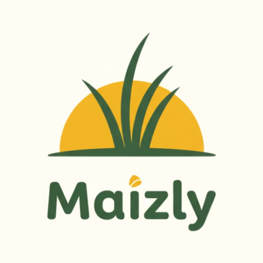
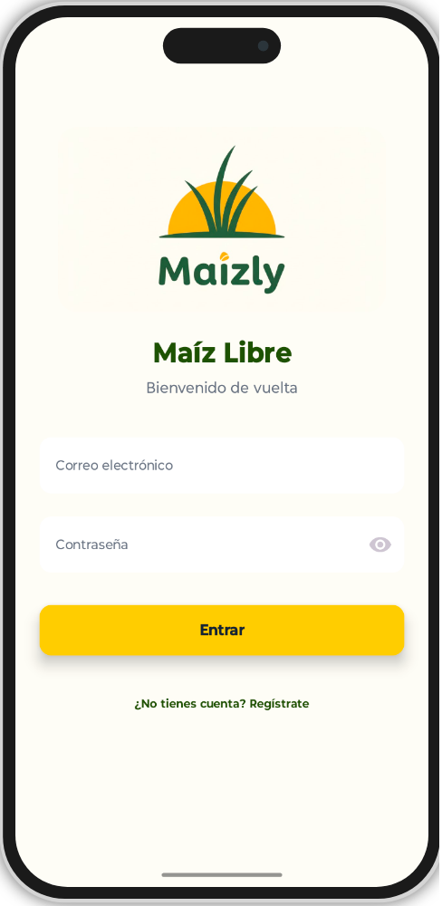
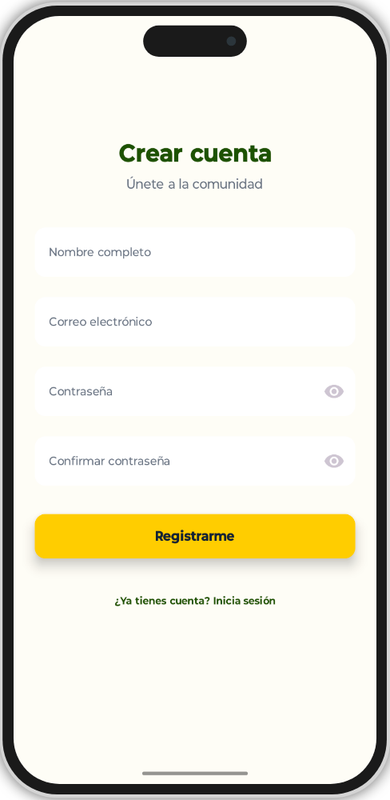
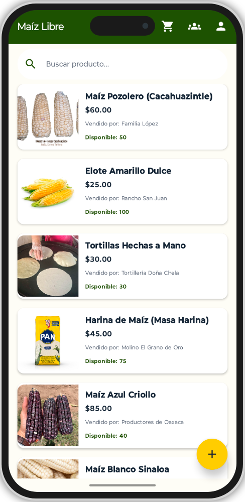
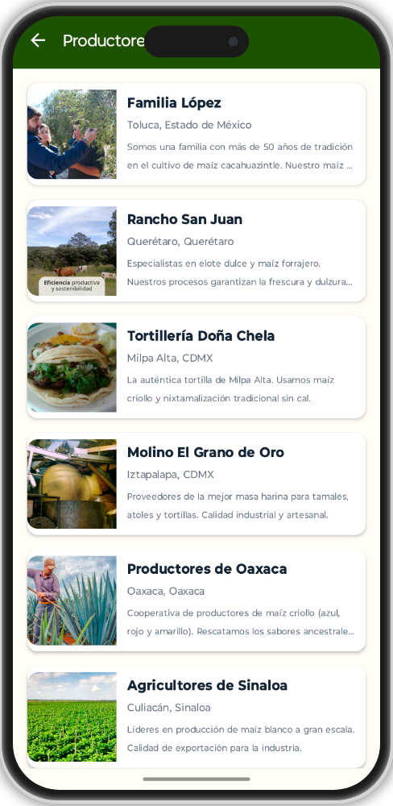
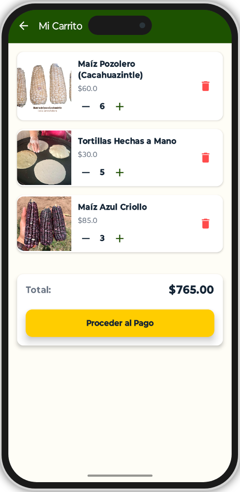
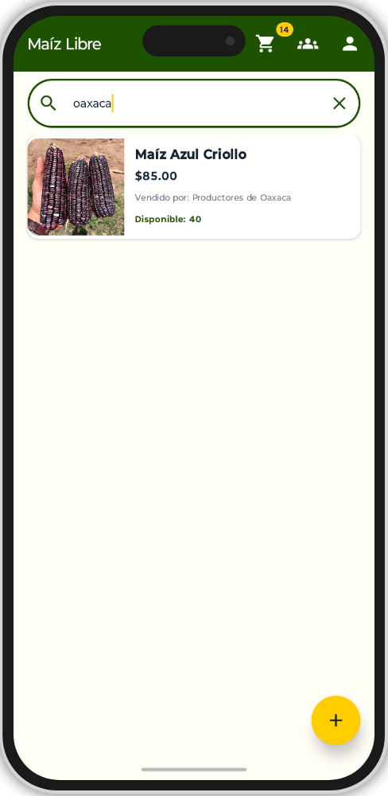

<div align="center">
    


# `>_` Maizly (Maíz Libre)

**Marketplace Agrícola Digital. Conectando productores rurales directamente con el mercado, sin intermediarios.**

[](LICENSE)
[](https://developer.android.com/)
[](https://kotlinlang.org/)
[]()
[]()

<br>

| 🌽 | **Innovación Social:** | *Incremento del 15% en ganancias para productores al eliminar intermediarios.* <br> Tecnología con impacto real. |
|--|-------------|:-----------------------------------------------------------------------------------------------------------------------------------|

<br>
</div>

<p align="center">
    
</p>

---

<details>
    <summary>Desplegar Tabla de Contenidos</summary>
    
<br>
        
- [Propósito](#-propósito)
- [Galería de Pantallas](#-galería-de-pantallas)
- [Características](#-características)
- [Arquitectura y Diseño](#-arquitectura-y-diseño)
- [Impacto y Resultados](#-impacto-y-resultados)
- [Instalación](#-instalación)
- [Créditos](#-créditos)

</details>

---

## `>_` Propósito

**Maizly** nace de una necesidad crítica en el campo mexicano: la comercialización del maíz enfrenta desafíos por prácticas tradicionales y falta de innovación. Los intermediarios ("coyotes") suelen imponer condiciones que afectan los ingresos de los productores.

Esta aplicación actúa como un **puente tecnológico**, ofreciendo un canal confiable, accesible y directo.

**Objetivos del Proyecto:**
- **Eliminar Intermediarios:** Permitir que el agricultor venda directamente al consumidor final.
- **Transparencia:** Precios claros y justos, visibles para todos.
- **Inclusión Digital:** Una interfaz diseñada para reducir la brecha tecnológica y la desconfianza en zonas rurales.

> [!NOTE]
> **Enfoque Educativo:** <br>
> El proyecto no es solo código; incluye un componente de capacitación y alfabetización digital para asegurar que los productores adopten la tecnología con confianza.

---

## `>_` 📱 Galería de Pantallas

Interfaz diseñada para ser intuitiva, segura y eficiente para usuarios con poca experiencia digital.

<div align="center">
    <br>
    <table>
        <tr>
            <td align="center" width="33%">
                <strong>Bienvenida e Inicio</strong><br>
                <em>Acceso amigable y directo.</em><br><br>
                
            </td>
            <td align="center" width="33%">
                <strong>Autenticación Segura</strong><br>
                <em>Protección de datos de usuario.</em><br><br>
                
            </td>
            <td align="center" width="33%">
                <strong>Catálogo de Productos</strong><br>
                <em>Visualización clara de ofertas.</em><br><br>
                
            </td>
        </tr>
        <tr>
            <td align="center" width="33%">
                <strong>Perfil de Productores</strong><br>
                <em>Conexión humana: "Conoce a quien cultiva".</em><br><br>
                
            </td>
            <td align="center" width="33%">
                <strong>Carrito de Compras</strong><br>
                <em>Gestión de pedidos simplificada.</em><br><br>
                
            </td>
            <td align="center" width="33%">
                <strong>Buscador Inteligente</strong><br>
                <em>Encuentra maíz por región o tipo.</em><br><br>
                
            </td>
        </tr>
    </table>
    <br>
</div>

---

## `>_` Características

- **Catálogo Digital:** Publicación de ofertas de maíz con fotografías, descripciones y precios.
- **Geolocalización:** Identificación de compradores y vendedores cercanos para reducir costos logísticos.
- **Perfiles de Productor:** Fichas informativas con ubicación y tipos de cultivo (Maíz Blanco, Amarillo, Harinas).
- **Gestión de Pedidos:** Carrito de compras electrónico con cálculo de totales en tiempo real.
- **Seguridad:** Pasarelas de pago y validación de usuarios para evitar fraudes y generar confianza.

---

## `>_` Arquitectura y Diseño

El desarrollo siguió una **Metodología Ágil (Scrum)** con sprints semanales y validación constante con usuarios reales (agricultores).

### 🛠️ Stack Tecnológico
| Componente | Tecnología | Descripción |
| :--- | :--- | :--- |
| **Móvil** | Android / Kotlin | Desarrollo nativo para máximo rendimiento. |
| **Diseño** | XML / Material Design | UI centrada en la usabilidad y accesibilidad. |
| **Base de Datos** | SQL / SQLite | Modelo relacional robusto (Usuarios, Productos, Carrito). |
| **Backend** | PHP (Conexión API) | Gestión de peticiones y lógica de servidor. |

### 🧩 Modelo Relacional
El sistema se estructura en cuatro entidades principales para garantizar la integridad de los datos:
1. **Usuarios:** Gestión de identidad y seguridad.
2. **Productores:** Datos de origen y ubicación de las cosechas.
3. **Productos:** Inventario, precios y relaciones de stock.
4. **Carrito:** Lógica transaccional de compraventa.

---

## `>_` Impacto y Resultados

Según las pruebas piloto realizadas y la investigación de campo:

- 📈 **Rentabilidad:** Los precios en la app superaron en un **15%** a los ofrecidos por intermediarios tradicionales.
- 🤝 **Confianza:** Se logró disminuir la resistencia tecnológica mediante capacitación acompañante.
- 🚜 **Modernización:** Validación de transacciones simuladas exitosas y uso de geolocalización efectiva.

---

## `>_` Instalación

Para probar el proyecto en un entorno local:

1.  Clonar el repositorio:
    ```bash
    git clone [https://github.com/DeathSilencer/Maizly-Agro-Marketplace.git](https://github.com/DeathSilencer/Maizly-Agro-Marketplace.git)
    ```
2.  Abrir el proyecto en **Android Studio**.
3.  Sincronizar los archivos Gradle.
4.  Configurar un dispositivo virtual (AVD) o conectar un físico.
5.  Ejecutar `Run 'app'`.

---

## `>_` Créditos

- 👨‍💻 **Desarrollador Principal:** David Platas
- 🎓 **Institución:** Universidad Politécnica del Valle de México
- 👥 **Colaboradores:** Jesús Ramírez, Dayana Ortiz, Yara Díaz.

<div align="center">
  <a href="https://github.com/DeathSilencer">
    
  </a>
</div>

<br>

### `>_` ⚖️ Disclaimer

> [!Warning]
> **Proyecto Académico:** <br>
> Este software fue diseñado como parte de un proyecto de investigación universitaria para la carrera de Ingeniería en Tecnologías de la Información. Si bien es funcional, se recomienda su uso con fines educativos o de demostración.
